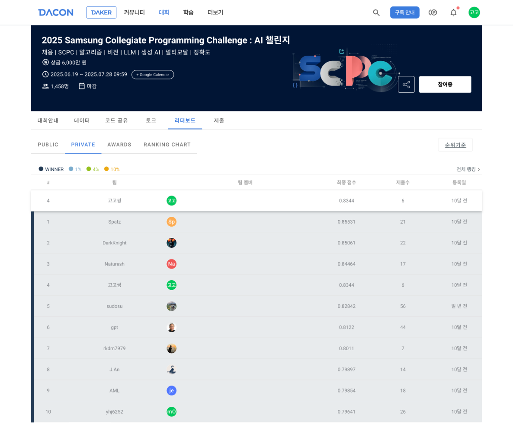

# SCPC 2025 — Gallery VQA

**Multiple-choice VQA on everyday smartphone photos**

- **Event**: 2025 Samsung Collegiate Programming Challenge: AI (Jun–Jul 2025)
- **Task**: Select the correct answer to multiple-choice questions about everyday gallery photos
- **Approach**: BLIP2-FLAN-T5-XL fine-tuned with LoRA + partial 4-bit quantization on a synthetically generated dataset
- **Result**: **4th** on private leaderboard — score 0.8344 ([Leaderboard](https://dacon.io/competitions/official/236500/leaderboard))

<p align="center">

</p>

<p align="center">

</p>

---

## Overview

The system has three phases:

**1. Synthetic dataset generation** — a three-step pipeline produces labeled VQA examples:
- `Qwen/Qwen-1_8B` generates scene prompts across categories (nature, travel, food, casual)
- `dreamlike-art/dreamlike-photoreal-2.0` renders each prompt into a realistic photo
- `llava-hf/llava-1.5-7b-hf` annotates each image with a description, a multiple-choice question, and the correct answer

**2. Fine-tuning** — `Salesforce/blip2-flan-t5-xl` is trained with:
- 8-bit quantization during training to fit within 40 GB VRAM
- LoRA adapters on the Q-Former (`query`, `key`, `value`, `dense`) — only ~0.1% of parameters are trainable

**3. Two-stage inference** — for each test image:
1. Generate a free-form description conditioned on the image + question
2. Predict the answer letter (A/B/C/D) using the description, image, and choices together

At inference the T5 decoder is swapped to a 4-bit quantized version for lower VRAM usage.

| Model | Public score |
|---|---|
| Baseline | 0.30486 |
| FLAN-T5 only | 0.81298 |
| **This work** | **0.83262** |

---

## Project Structure

```
.
├── configs/
│   └── config.py            # All hyperparameters and paths in one dataclass
├── dataset/
│   ├── generate/
│   │   ├── prompts.py       # Step 1: scene prompt generation (Qwen)
│   │   ├── images.py        # Step 2: image synthesis (Stable Diffusion)
│   │   ├── qa_pairs.py      # Step 3: VQA annotation (LLaVA)
│   │   ├── real_qa.py       # COCO val2017 download + annotation
│   │   └── eval_images.py   # Flickr30k download for eval
│   └── loader.py            # Dataset preprocessing for training
├── model/
│   ├── build.py             # Model loading (training / inference variants)
│   ├── trainer.py           # CustomTrainer + TrainingArguments factory
│   └── predictor.py         # Two-stage inference logic
├── utils/
│   └── postprocess.py       # Answer extraction, submission builder
├── generate_dataset.py      # Entry point: run full generation pipeline
├── generate_eval_dataset.py # Entry point: build external eval set (Flickr30k + LLaVA)
├── train.py                 # Entry point: fine-tune the model
├── inference.py             # Entry point: run inference, save submission
├── ablation.py              # Entry point: compare variants on a labeled eval set
├── pyproject.toml
└── requirements.txt
```

Legacy prototype notebooks and scripts are preserved in `.legacy/`.

---

## Environment

- OS: Linux
- GPU: NVIDIA GPU (~20 GB VRAM minimum)
- CUDA: 12.8
- Python: 3.10+

---

## Installation

**Step 1 — PyTorch with CUDA 12.8:**

```bash
pip install torch==2.7.1+cu128 torchvision==0.22.1+cu128 torchaudio==2.7.1+cu128 \
  --index-url https://download.pytorch.org/whl/cu128
```

**Step 2 — remaining dependencies:**

```bash
pip install -r requirements.txt
# or as an editable install (includes Jupyter extras):
pip install -e ".[jupyter]"
```

---

## Usage

### 1. Generate the training dataset

```bash
python generate_dataset.py
```

Runs the three-step pipeline sequentially. Each step is skipped automatically if its output already exists.

### 2. Fine-tune

```bash
python train.py
```

Saves the LoRA adapter and tokenizer to `./model/finetuned-blip2-flan-t5-xl/`.

### 3. Inference

```bash
python inference.py
```

Reads `./data/given/test.csv`, runs two-stage prediction, and writes `test_inference_final.csv`.

### 4. Build the eval dataset

```bash
python generate_eval_dataset.py
```

Downloads Flickr30k images (a different source from the COCO training data) and annotates them with LLaVA. Outputs a labeled CSV at `data/eval/eval_question_answer.csv`. Each step is skipped if its output already exists.

Image count is controlled by `num_eval_images` in `configs/config.py` (default 500).

### 5. Ablation

```bash
python ablation.py --eval_csv data/eval/eval_question_answer.csv
python ablation.py --eval_csv data/eval/eval_question_answer.csv --output results.csv
```

Compares named variants on a labeled eval set. The eval CSV must include an `answer` column with ground-truth labels.

Default variants: two-stage vs. single-stage inference, fine-tuned vs. base model.  
Additional variants (dataset composition, LoRA rank) can be enabled by editing the `VARIANTS` list in `ablation.py`.

---

## Configuration

All paths, model IDs, and hyperparameters live in `configs/config.py`. Edit the dataclass fields directly — no CLI flags or YAML files needed.

Key fields:

| Field | Default | Description |
|---|---|---|
| `base_model_id` | `Salesforce/blip2-flan-t5-xl` | Base BLIP2 model |
| `lora_r` / `lora_alpha` | 32 / 64 | LoRA rank and scaling |
| `lr_scheduler_type` | `"cosine"` | LR scheduler (`"cosine"`, `"linear"`, etc.) |
| `warmup_ratio` | 0.1 | Fraction of steps used for LR warmup |
| `num_epochs` | 5 | Training epochs |
| `batch_size` | 8 | Per-device batch size |
| `input_max_length` | 384 | Tokenizer input truncation |
| `num_prompt_generations` | 1000 | Scene prompt generation iterations |
| `eval_dir` | `./data/eval` | Eval dataset directory |
| `num_eval_images` | 500 | Number of Flickr30k images to download for eval |
